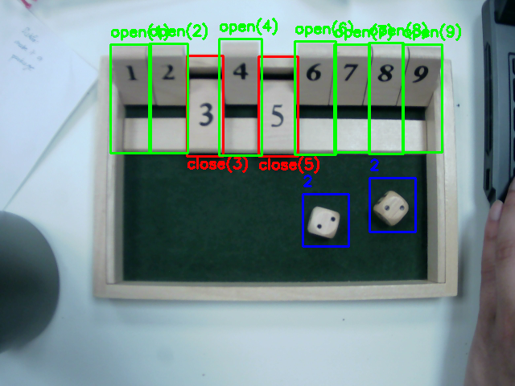

# 🧠 Shut The Box - Game State Detection with YOLOv8

A Python project to detect and track the state of the board game **Shut the Box** using a custom-trained YOLOv8 model. It identifies the state (open/closed) of all 9 tiles and detects dice values in real-time using a webcam.


---

## 📌 Features

- Real-time game state detection using a camera
- Detects:
  - Tiles: open/closed states for tiles 1 to 9
  - Dice values (1–6)
- Determines possible valid moves given the dice roll
- Automatically ends game when no valid move is left and give the score

---

## 🧠 How It Works

1. **YOLOv8** detects tile states and dice values from camera input.
2. **Tile labels** are mapped to tile numbers and their states (open/closed).
3. **Dice values** are summed.
4. The game logic calculates and suggests a valid move (sum of open tiles equals dice value).
5. Game ends when no valid move is possible.

---

## ⚙️ Setup & Installation

1. Clone the repository
    ```bash
    git clone https://github.com/mn-nafis/shut_the_box_detector.git
    cd shut-the-box-detector
    ```
2. Create a virtual environment
    ```bash
    python -m venv .venv
    source .venv/bin/activate  # On Windows: .venv\Scripts\activate
    ```
3. Create a virtual environment
    ```bash
    pip install -r requirements.txt
    ```
---

## 📸 Demonstration

Check the link below to see me play the shut the box using this project:

https://www.play.mdx.ac.uk/media/Shut+the+box+using+YOLOv8/1_uluqihek


## 🙋 Author


name: Nawfeesh Mohamed Noorullah

email: mnnawfeesh@gmail.com

